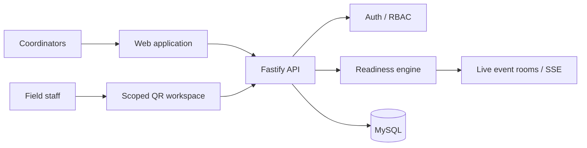

<div align="center">

# Gurmilan Singh

### Software Engineer · Computer Engineering

**I build software that has to survive contact with real users.**

Full-stack systems around workflows, permissions, state, relational data, reliability and deployment.

<br>

<a href="https://gurmilansingh.com">
  <strong>gurmilansingh.com</strong>
</a>
&nbsp;&nbsp;&nbsp;
<a href="https://www.linkedin.com/in/gurmilan-singh-017b28284">
  
</a>
&nbsp;&nbsp;&nbsp;
<a href="mailto:gurmilans01@gmail.com">
  
</a>

</div>

---

## `01` / Engineering

I am most interested in software where the interface is only one part of the problem.

I like working on systems with **real workflows, explicit state, backend-owned authorization and relational data** — especially when correctness still matters after the application leaves a development machine.

`RBAC` · `state transitions` · `transactions` · `concurrency` · `auditability` · `failure paths` · `deployment`

### Toolbox

<table>
<tr>
<td><strong>Languages</strong></td>
<td>JavaScript · C# · Java · SQL · Bash</td>
</tr>
<tr>
<td><strong>Frontend</strong></td>
<td>React · JavaFX · HTML · CSS</td>
</tr>
<tr>
<td><strong>Backend</strong></td>
<td>Node.js · Fastify · Express · ASP.NET Core</td>
</tr>
<tr>
<td><strong>Data</strong></td>
<td>MySQL · SQL Server · relational modelling</td>
</tr>
<tr>
<td><strong>Systems</strong></td>
<td>Linux · Docker · VMware ESXi · networking · SSH</td>
</tr>
<tr>
<td><strong>Delivery</strong></td>
<td>Git · GitHub Actions · Azure</td>
</tr>
</table>

---

## `02` / Opssemble

> **Flagship product · Private / Pre-launch**

### Event operations and readiness software for teams coordinating live work.

Opssemble exists because operational readiness should not have to be reconstructed from WhatsApp messages, spreadsheets and scattered task updates.

It models an event as **live operational state** rather than a collection of disconnected tasks.



### Engineering highlights

* server-enforced **event RBAC** across coordinator and staff workflows
* task and exception driven **readiness** at event and area level
* **Server-Sent Events** for operational updates and viewer presence
* revocable **QR capabilities** for temporary scoped field access
* mobile operator workflows including **My Shift** and cross-event queues
* protected completion evidence and an operational **audit timeline**
* authentication and Google OAuth
* reports, CSV export, reusable templates and PWA support

`React` · `Vite` · `Material UI` · `TanStack Query` · `Fastify` · `Node.js` · `MySQL` · `SSE` · `JWT`

**[View the Opssemble case study →](https://gurmilansingh.com/opssemble)**

---

## `03` / Selected systems

### MaintOps

**Maintenance operations platform**

A full-stack system handling maintenance work from initial report through assignment, resolution, SLA tracking and operational reporting.

The interesting part is not the ticket form. It is the workflow behind it.

**Engineering**

`transactional state transitions` · `backend RBAC` · `versioned SLA policies` · `background workers` · `immutable history` · `audited administration`

Optional AI assistance is deliberately isolated from authoritative business state.

`React` · `Fastify` · `MySQL` · `REST` · `Vitest`

**[Explore repository →](https://github.com/gurmilans-dev/maintops-public)**

---

### Gurmat Saanj

**Real-time shared Gurbani reading system**

Built for use at a local Gurdwara.

Gurmat Saanj listens to live Punjabi recitation, matches recognized speech against known Gurbani lines and synchronizes the selected content across a projector and connected devices.

The main engineering problem is **synchronization rather than speech recognition alone**.

Connected devices remain part of the same shared session while retaining their own reading preferences.

`React` · `Node.js` · `Express` · `Web Speech API` · `BaniDB`

**[Read the case study →](https://gurmilansingh.com/gurmat-saanj)**

---

### Production Business Platform

**Commercial software · Production**

Internal business software used in real operational workflows.

I work across the system rather than one isolated layer:

`UI → API → business rules → relational data → operations`

My work includes application interfaces, APIs, database-backed workflows, role-based permissions, releases, maintenance and user support.

The implementation and business data are confidential.

**[Read the case study →](https://gurmilansingh.com/erp-case-study)**

---

### SIR Epidemic Simulator

**Agent-based epidemic simulation · Java**

A JavaFX simulation where individual agents move through a bounded environment and transition between epidemiological states through proximity-based interactions.

It includes configurable infection parameters, mortality, immunity, quarantine, social distancing, live statistics and CSV export.

The simulation engine executes independently from the JavaFX rendering thread.

`Java 17` · `JavaFX` · `Maven` · `FXML` · `Concurrency`

**[Explore repository →](https://github.com/gurmilans-dev/sir-simulation)**

---

## `04` / Currently building

### Alfaaz

**Multilingual writing system · Private / Active development**

A private writing platform for poetry, shayari, fragments and longer-form work across English, Hindi and Punjabi.

Current engineering areas include:

* autosave and conflict handling
* revisions and restore
* fragments and collections
* focus sessions
* transliteration
* voice notes
* local exports
* repository-level user data isolation

Privacy boundaries are deliberate: unfinished transliteration stays in the browser, local music does not reach the server and exports are generated client-side.

`React` · `Express` · `MySQL` · `Zod` · `Playwright` · `Vitest`

---

## `05` / How I build

```text
01  understand the real workflow
02  define state and ownership
03  make authorization a backend concern
04  keep the data model explicit
05  design failure paths
06  automate repeatable work
07  test assumptions
08  deploy
09  find what reality disagrees with
10  fix it
```

> **External services and LLMs are tools, not architectural authorities.**

When I use them, I prefer bounded inputs, validated outputs, explicit failure modes and human control over consequential actions.

---

## `06` / Current

```yaml
location:   Modena, Italy
role:       Software Developer
education:  BSc Computer Engineering
graduation: December 2026

focus:
  - full-stack systems
  - backend architecture
  - relational data
  - operational software
  - reliable deployment
```

---

<div align="center">

### Build software that still makes sense after deployment.

**[gurmilansingh.com →](https://gurmilansingh.com)**

</div>
