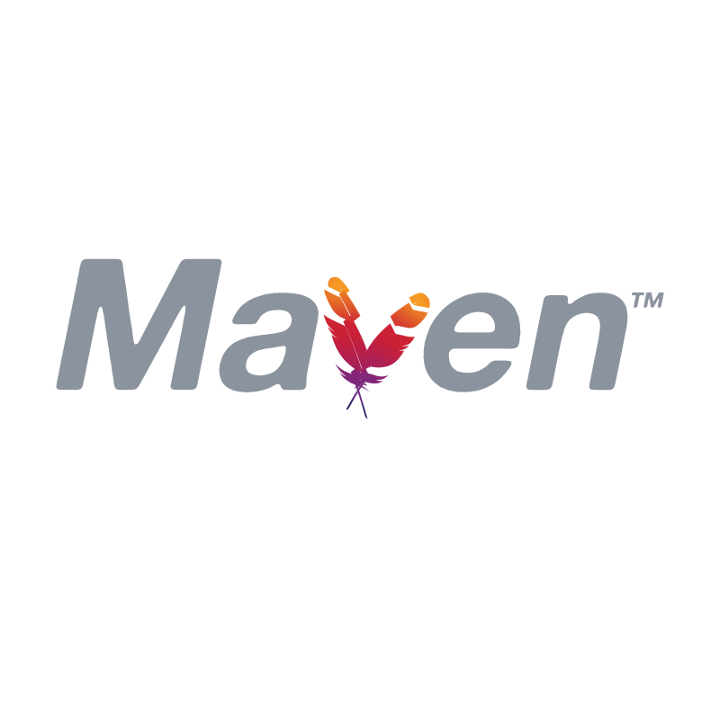
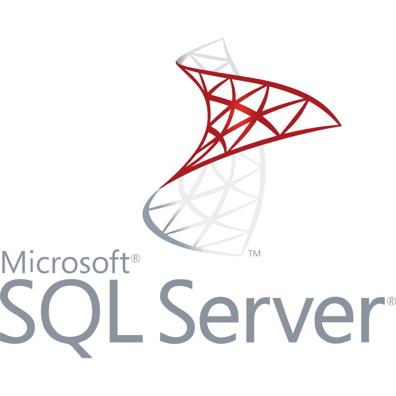

<div align="center">

# Gurmilan Singh



<br>

<a href="https://gurmilansingh.com">
  <strong>gurmilansingh.com</strong>
</a>
&nbsp;&nbsp;&nbsp;&nbsp;

<a href="https://www.linkedin.com/in/gurmilan-singh-017b28284">
  
</a>
&nbsp;&nbsp;&nbsp;

<a href="mailto:gurmilans01@gmail.com">
  
</a>

</div>

---

## `01` / $ whoami

```yaml
name: Gurmilan Singh
location: Modena, Italy

role:
  - Software Developer
  - Computer Engineering student
# interested_in:
#   - full-stack systems
#   - backend architecture
#   - relational data
#   - operational software
#   - distributed state
#   - reliable deployment

currently:
  building: Alfaaz
  working : Phema s.r.l.
  shipping: software people actually use
  graduating: December 2026
```

I like software where the interface is only one part of the problem.

The interesting work usually starts behind it:

**Who can do what? What state is the system really in? What happens when something fails? Can we explain how it got there?**

<details>
<summary><code>$ man gurmilan</code></summary>

<br>

```troff
GURMILAN(1)                  Developer Manual                  GURMILAN(1)

NAME
       gurmilan — builds software that survives contact with real users

SYNOPSIS
       gurmilan [--full-stack] [--backend-heavy] [--own-the-deploy]
                [--ask-about-edge-cases] <problem>

DESCRIPTION
       Takes a real operational workflow and returns a system whose state
       is explicit, whose permissions are enforceable server-side, and
       whose failure paths were designed rather than discovered.

OPTIONS
       --full-stack
              Works across UI, API, data and deployment.

       --backend-heavy
              Default. This is usually where the problem actually lives.

       --own-the-deploy
              Considers a feature unfinished until it runs somewhere real.

       --ask-about-edge-cases
              Cannot be disabled.

ENVIRONMENT
       LOCATION     Modena, Italy
       LANGUAGES    Italian, Punjabi, English, Hindi
       AVAILABLE    December 2026

EXIT STATUS
       0      Shipped.
       1      Shipped, then found what reality disagreed with. See fix(1).

SEE ALSO
       gurmilansingh.com
```

</details>

---

## `02` / Flagship

### Opssemble

> **Operational readiness shouldn't have to be reconstructed from WhatsApp messages, spreadsheets and someone's memory.**

Event operations software for teams coordinating live work.

Opssemble models an event as **live operational state** instead of a pile of disconnected tasks.



The parts I care about most:

`event RBAC`
·
`readiness modelling`
·
`state transitions`
·
`SSE`
·
`scoped QR capabilities`
·
`audit history`
·
`PWA`

<p>
  
  &nbsp;
  
  &nbsp;
  
  &nbsp;
  
  &nbsp;
  
</p>

**[Explore the Opssemble case study →](https://gurmilansingh.com/opssemble)**

---

## `03` / Things that escaped localhost

<table>
<tr>
<td width="50%" valign="top">

### MaintOps

> **Maintenance tickets are easy. Maintenance workflows aren't.**

A full-stack operations platform covering maintenance work from first report through assignment, SLA tracking, resolution and audit history.

The interesting bits:

`transactional state transitions`
`backend-owned RBAC`
`versioned SLA policies`
`background workers`
`immutable history`

Optional AI assists with specific tasks without becoming authoritative business logic.

<br>

<p>
  
  &nbsp;
  
  &nbsp;
  
</p>

**[Open the repository →](https://github.com/gurmilans-dev/maintops-public)**

</td>
<td width="50%" valign="top">

### Gurmat Saanj

> **Speech recognition was only half the problem. Keeping the room in sync was the other half.**

A real-time shared Gurbani reading system built for use at a local Gurdwara.

It listens to Punjabi recitation, matches recognised speech against known Gurbani and synchronises selected content across a projector and connected devices.

Each device stays in the same session while retaining its own reading preferences.

<br>

<p>
  
  &nbsp;
  
  &nbsp;
  
</p>

**[See how it works →](https://gurmilansingh.com/gurmat-saanj)**

</td>
</tr>

<tr>
<td width="50%" valign="top">

### SIR Epidemic Simulator

> **Tiny JavaFX people making questionable epidemiological decisions.**

An agent-based epidemic simulation where individuals move through a bounded environment and transition between epidemiological states through proximity-based interactions.

Includes configurable transmission, mortality, immunity, quarantine, social distancing, live statistics and CSV export.

The simulation engine runs independently from JavaFX rendering.

<br>

<p>
  
  &nbsp;
  
</p>

**[Start an outbreak →](https://github.com/gurmilans-dev/sir-simulation)**

</td>
<td width="50%" valign="top">

### Production Business Platform

> **The project I can describe, but can't `git push`.**

Commercial internal software used in real operational workflows.

I work across the system rather than one isolated layer:

```text
UI
↓
API
↓
business rules
↓
relational data
↓
operations
```

The implementation and business data are confidential.

The engineering lessons aren't.

<br>

<p>
  
  &nbsp;
  
  &nbsp;
  
</p>

**[Read the case study →](https://gurmilansingh.com/erp-case-study)**

</td>
</tr>
</table>

<details>
<summary><code>$ ./sir --start-outbreak</code> &nbsp;&nbsp;<sub>(you were told to)</sub></summary>

<br>



<sub>26 agents, β = 0.30, γ = 0.085. The curves aren't decorative — the agents change state on the schedule that integration produced. One of them never gets infected. Lucky.</sub>

</details>

<details>
<summary><code>$ git log --oneline --author="past me"</code></summary>

<br>

```console
4a91c2e  fix: authorization checks belong on the server, not in the router
8b30fd1  fix: a state machine, not four booleans that mostly agree
c17ae44  fix: stop letting the client tell us who it is
2f0d9b3  fix: soft delete was not a feature, it was a bug with a flag
9e4c1a8  fix: the background job needed to be idempotent all along
55b8e07  fix: "we'll add tests later" turned out to be load-bearing
e02f77a  fix: the migration ran fine locally (it did not run fine)
```

Every one of these is a thing I now design for up front. That's most of what
`06 / How I build` actually is — a list of mistakes with the dates filed off.

</details>

---

## `04` / Toolbox

<table>
<tr>
<td align="center" width="90">
<br>
<sub>JavaScript</sub>
</td>

<td align="center" width="90">
<br>
<sub>C#</sub>
</td>

<td align="center" width="90">
<br>
<sub>Java</sub>
</td>

<td align="center" width="90">
<br>
<sub>React</sub>
</td>

<td align="center" width="90">
<br>
<sub>Node.js</sub>
</td>

<td align="center" width="90">
<br>
<sub>Fastify</sub>
</td>

<td align="center" width="90">
<br>
<sub>.NET</sub>
</td>
</tr>

<tr>
<td align="center" width="90">
<br>
<sub>MySQL</sub>
</td>

<td align="center" width="90">
<br>
<sub>SQL Server</sub>
</td>

<td align="center" width="90">
<br>
<sub>Docker</sub>
</td>

<td align="center" width="90">
<br>
<sub>Linux</sub>
</td>

<td align="center" width="90">
<br>
<sub>Git</sub>
</td>

<td align="center" width="90">
<br>
<sub>Actions</sub>
</td>

<td align="center" width="90">
<br>
<sub>Azure</sub>
</td>
</tr>
</table>

> [!TIP]
> Tools change. The things I care about don't: explicit state, clear ownership, enforceable permissions and boringly reliable deployments.

---

## `05` / Currently cooking

### Alfaaz

> **A place for words before they're ready to become something.**

A private multilingual writing system for poetry, shayari, fragments and longer-form work across English, Hindi and Punjabi.

Currently working on:

- [ ] autosave + conflict handling
- [ ] revisions + restore
- [ ] fragments + collections
- [ ] focus sessions
- [ ] transliteration
- [ ] voice notes
- [ ] local exports
- [ ] user-data isolation

Privacy boundaries are intentional.

Unfinished transliteration stays in the browser.
Local music stays local.
Exports are generated client-side.

<p>
  
  &nbsp;
  
  &nbsp;
  
  &nbsp;
  
  &nbsp;
  
  &nbsp;
  
</p>

`private` · `active development`

---

## `06` / How I build



```text
01  understand the real workflow
02  define state and ownership
03  make authorization a backend concern
04  keep the data model explicit
05  design the failure paths
06  automate repeatable work
07  test assumptions
08  deploy
09  find what reality disagrees with
10  fix it
```

> [!IMPORTANT]
> **External services and LLMs are tools, not architectural authorities.**
>
> When I use them, I prefer bounded inputs, validated outputs, explicit failure modes and human control over consequential actions.

---

## `07` / Service level agreement

<table>
<tr><th align="left">metric</th><th align="left">target</th><th align="left">observed</th></tr>
<tr><td>uptime</td><td><code>99.9%</code></td><td>degrades near exam season</td></tr>
<tr><td>response time</td><td><code>&lt; 24h</code></td><td>faster if the problem is interesting</td></tr>
<tr><td>scheduled maintenance</td><td>Sundays</td><td>Gurdwara first, then code</td></tr>
<tr><td>known issue</td><td>—</td><td>asks "what happens when this fails?" mid-demo</td></tr>
<tr><td>rollback plan</td><td>required</td><td>yes, genuinely, always</td></tr>
</table>

<details>
<summary><code>$ cat .env</code></summary>

<br>

```console
cat: .env: No such file or directory

$ cat .env.example
DATABASE_URL=
SESSION_SECRET=
JWT_SECRET=
# this one is committed. the other one never was.
# that distinction is most of what `03 / make authorization a
# backend concern` means in practice.
```

<details>
<summary><sub>you kept clicking, so — <code>$ history | tail -5</code></sub></summary>

<br>

```console
  498  git commit -m "final"
  499  git commit -m "final (actually)"
  500  git commit --amend -m "fix: SLA policies are versioned now"
  501  git push
  502  ssh prod 'journalctl -u api -f'
```

</details>

</details>

<details>
<summary><code>$ ./hire.sh --dry-run</code></summary>

<br>

```console
▸ availability ......... December 2026            [ OK ]
▸ location ............. Modena, IT / remote      [ OK ]
▸ interested in ........ operational software     [ OK ]
▸ stack ................ full-stack, backend-heavy [ OK ]
▸ resolving contact .... gurmilans01@gmail.com

dry run complete — no changes made.
exit 0
```

To apply for real: **[email](mailto:gurmilans01@gmail.com)** · **[LinkedIn](https://www.linkedin.com/in/gurmilan-singh-017b28284)** · **[gurmilansingh.com](https://gurmilansingh.com)**

</details>

---

<div align="center">

### Build software that still makes sense after deployment.

<br>

<a href="https://gurmilansingh.com">
  
  &nbsp;
  <strong>gurmilansingh.com</strong>
</a>

<br><br>

<sub>Modena, Italy · Software Developer · Computer Engineering</sub>

<br><br>

<sub><code>$ exit 0</code></sub>

</div>
