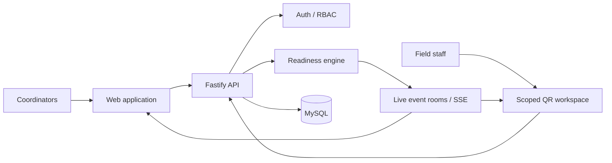
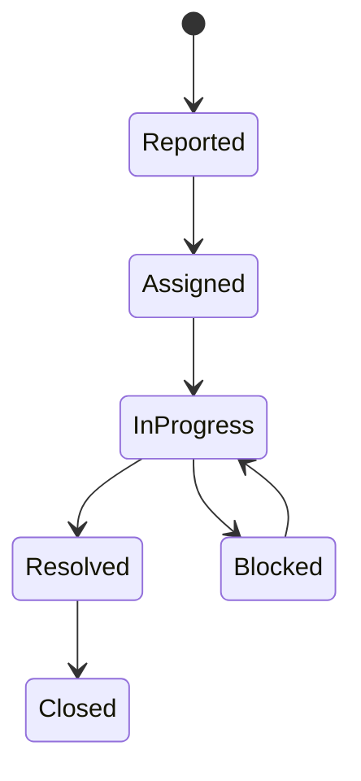
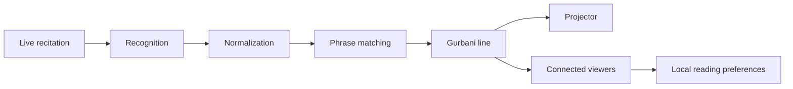

<div align="center">

# Gurmilan Singh

### Software Engineer · Computer Engineering

**I build software that has to survive contact with real users.**

`systems > screens`  ·  `workflow > CRUD`  ·  `reliability > demos`

<br>

[](https://gurmilansingh.com)
[](https://www.linkedin.com/in/gurmilan-singh-017b28284)
[](mailto:gurmilans01@gmail.com)

</div>

---

## `01` / Engineering profile

I build full-stack systems around **real workflows, permissions, state, relational data and operational constraints**.

The UI matters — but I am usually more interested in everything that has to remain correct behind it:

```text
user action
    │
    ▼
interface
    │
    ▼
API boundary
    │
    ▼
domain rules
    │
    ▼
authorization
    │
    ▼
relational state
    │
    ▼
operations
    │
    ▼
real users
```

That means thinking about:

`RBAC` · `state transitions` · `transactions` · `concurrency` · `failure paths` · `auditability` · `deployment` · `production support`

---

## `02` / Stack

<div align="center">

### Languages

<kbd>JavaScript</kbd> <kbd>C#</kbd> <kbd>Java</kbd> <kbd>SQL</kbd> <kbd>Bash</kbd>

### Application

<kbd>React</kbd> <kbd>Node.js</kbd> <kbd>Fastify</kbd> <kbd>Express</kbd> <kbd>ASP.NET Core</kbd> <kbd>JavaFX</kbd>

### Data & Infrastructure

<kbd>MySQL</kbd> <kbd>SQL Server</kbd> <kbd>Docker</kbd> <kbd>Linux</kbd> <kbd>Azure</kbd> <kbd>GitHub Actions</kbd>

</div>

---

## `03` / Flagship — Opssemble

> **Event operations and readiness software for teams coordinating live work.**
> Private · Pre-launch

Operational readiness should not have to be reconstructed from WhatsApp messages, spreadsheets and scattered task updates.

**Opssemble** models an event as live operational state.



### Engineering highlights

* **Server-enforced event RBAC** across coordinator and staff workflows
* **Task + exception driven readiness** at event and area level
* **Server-Sent Events** for live operational state and viewer presence
* **Revocable QR capabilities** for temporary scoped field access
* Mobile operator workflows including **My Shift** and cross-event queues
* Protected completion evidence and **operational audit timeline**
* Authentication + Google OAuth
* Reports, CSV export and reusable event templates
* PWA support

**Stack**

<kbd>React</kbd> <kbd>Vite</kbd> <kbd>Material UI</kbd> <kbd>TanStack Query</kbd> <kbd>Fastify</kbd> <kbd>Node.js</kbd> <kbd>MySQL</kbd> <kbd>SSE</kbd> <kbd>JWT</kbd> <kbd>OAuth</kbd>

**[Read the Opssemble case study →](https://gurmilansingh.com/opssemble)**

---

## `04` / Selected systems

| Project                                                                      | System                           | Engineering focus                                              |
| ---------------------------------------------------------------------------- | -------------------------------- | -------------------------------------------------------------- |
| **[MaintOps](https://github.com/gurmilans-dev/maintops-public)**             | Maintenance operations platform  | Transactions · RBAC · SLA policies · workers · audit history   |
| **[Gurmat Saanj](https://gurmilansingh.com/gurmat-saanj)**                   | Real-time shared Gurbani reading | Speech matching · synchronization · multi-client state         |
| **[Production Business Platform](https://gurmilansingh.com/erp-case-study)** | Commercial internal software     | APIs · relational workflows · permissions · releases · support |
| **[SIR Simulator](https://github.com/gurmilans-dev/sir-simulation)**         | Agent-based epidemic simulation  | Java concurrency · simulation engine · JavaFX · data export    |

---

### MaintOps

**Maintenance operations platform**

A full-stack system that models a maintenance request from initial report through assignment, work, resolution, SLA tracking and operational reporting.

The interesting part isn't the ticket form. It's the state machine behind it.



Engineering includes:

* transactional state transitions
* backend-owned RBAC and privileges
* versioned SLA policies
* scheduled background operations
* immutable operational history
* protected evidence delivery
* audited administration
* optional AI assistance isolated from authoritative business state

<kbd>React</kbd> <kbd>Fastify</kbd> <kbd>MySQL</kbd> <kbd>REST</kbd> <kbd>RBAC</kbd> <kbd>Vitest</kbd>

**[Explore repository →](https://github.com/gurmilans-dev/maintops-public)**

---

### Gurmat Saanj

**Real-time shared Gurbani reading system**

Built for use at a local Gurdwara.

The system listens to live Punjabi recitation, matches recognized speech against known Gurbani lines and synchronizes the selected content across a projector and connected devices.

The interesting engineering problem is **shared synchronization**, not speech recognition alone.



<kbd>React</kbd> <kbd>Node.js</kbd> <kbd>Express</kbd> <kbd>Web Speech API</kbd> <kbd>BaniDB</kbd>

**[Read case study →](https://gurmilansingh.com/gurmat-saanj)**

---

### Production Business Platform

**Commercial software · Production**

Internal business software used in real operational workflows.

My work spans the system rather than one isolated layer:

```text
interface
   │
   ▼
  API
   │
   ▼
business rules
   │
   ▼
relational data
   │
   └────► permissions
          releases
          maintenance
          user support
```

The implementation and business data are confidential.

**[Read case study →](https://gurmilansingh.com/erp-case-study)**

---

### SIR Epidemic Simulator

**Agent-based epidemic simulation · Java**

A JavaFX simulation where individual agents move through a bounded environment and transition between epidemiological states through proximity-based interactions.

The simulation engine runs independently from the JavaFX rendering thread.

Includes configurable:

`infection` · `mortality` · `immunity` · `quarantine` · `social distancing` · `live statistics` · `CSV export`

<kbd>Java 17</kbd> <kbd>JavaFX</kbd> <kbd>Maven</kbd> <kbd>FXML</kbd> <kbd>Concurrency</kbd>

**[Explore repository →](https://github.com/gurmilans-dev/sir-simulation)**

---

## `05` / Currently building

### Alfaaz

> **Multilingual writing system · Private · Active development**

A writing platform for poetry, shayari, fragments and long-form work across **English, Hindi and Punjabi**.

```text
writing
  │
  ├── autosave + conflict handling
  ├── revisions + restore
  ├── fragments + collections
  ├── focus sessions
  ├── transliteration
  ├── voice notes
  └── local exports
           │
           ▼
      private archive
```

Privacy boundaries are deliberate:

* unfinished transliteration stays in the browser
* local music never reaches the server
* exports are generated client-side
* user-owned data is scoped at the repository layer

<kbd>React</kbd> <kbd>Express</kbd> <kbd>MySQL</kbd> <kbd>Zod</kbd> <kbd>Playwright</kbd> <kbd>Vitest</kbd>

---

## `06` / How I engineer systems

```text
01  understand the real workflow

02  identify state and ownership

03  define system boundaries

04  make authorization a backend concern

05  model the data explicitly

06  design failure paths

07  automate repeatable work

08  test assumptions

09  deploy

10  find what reality disagrees with

11  fix it
```

> **External services and LLMs are tools, not architectural authorities.**

I prefer bounded inputs, validated outputs, explicit failure modes and human control over consequential actions.

---

## `07` / Current

```yaml
location:   Modena, Italy
role:       Software Developer
education:  BSc Computer Engineering
graduation: December 2026
focus:
  - full-stack systems
  - backend architecture
  - relational data
  - operational software
  - reliable deployment
```

---

<div align="center">

### Build software that still makes sense after deployment.

**[gurmilansingh.com →](https://gurmilansingh.com)**

<sub>Modena, Italy · Software Engineering · Computer Engineering</sub>

</div>
